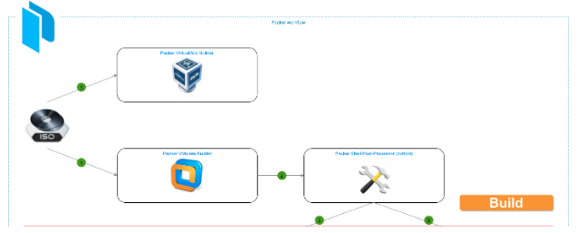

## Ideology

We would like to have one VM template for operation system. Motivation for this decision:

*   decrease time for image maintainership (maintain one template is much easy and require less time then maintain one template)
*   provide ability to run DApps Server locally for development propose (on workstation)
*   add possibility to run TON DApps Server in a bunch of clouds and providers
*   standartize upgrading and delivery of new version
*   have pre-installed image in universal format (OVA)


## Running

We propose to use [packer](https://www.packer.io/) tool to build Virtual Machine Templates that uses VirtualBox workstation / player and ovftool as underlying software.

Using this workflow with lead you from regular ISO image to ready to use in any virtualization provider. (OVA file) e.q VMware/VirtualBox.

Here is a diagram that represents template build and deploy workflow:





#### **Requirements**


*   [Virtualbox](https://www.virtualbox.org/), for packer virtualbox builder 
*   [VMware Workstation](https://www.vmware.com/products/workstation-pro.html) or [VMware Player](https://www.vmware.com/content/vmware/vmware-published-sites/us/products/workstation-player.html.html), for packer vmware builder (optional)
*   [packer](https://www.packer.io/downloads) version 1.5 or higher


#### **Workflow**


1. We need an ISO file that is used as a source from which OS will be installed during build process in packer builder. Packer will download ISO from the provided to him url itself and will reuse (cache) if for further builds. After ISO download finished (if needed), the build process for the selected builder will start. By default packer will build image via all available builders. For building purposes it is better to disable virtualbox builder, because it is intended to be used only for testing and developing purposes.
2. After conversion, the image is ready to be uploaded into any proder.


#### **Custom variables**

Packer requires that almost all variables where initialized before packer run. That's why as best practice it will be maintaining a separate variable file which will keep all needed values for variables.

To do this create a file **variables.json** in the packer project root directory and fill it with data.


#### **Execution**

Packer execution should be done in the packer project root directory.

**packer run**


```
packer build -var 'build=5' -var-file variables.json -force -except virtualbox,upload-sg ubuntu.json
```


**-var 'build=5'** — should be incremented on each build run, the last build number available in **Template versions list** table

**-var-file variables.json** — passes variables from file varibles.json to packer build

**-force** — will trigger rewriting of existing image

**-except=virtualbox,upload-sg** — will disable execution of virtualbox builder and upload-sg post-processor


---


## Development


#### **Project repository:  [https://github.com/SkySonR/TON-OS-DApp-Server-Packer](https://github.com/SkySonR/TON-OS-DApp-Server-Packer)**


#### **Project structure**

**packer structure**


```
$ ls -l
ubuntu.json
http
image
iso -> packer_cache/iso/
log
packer_cache
variables.json
```


**ubuntu.json** — packer template for Ubuntu

**http** — directory that packer will serve as http server root directory with file **ks7.cfg** that holds [kickstart](https://docs.centos.org/en-US/centos/install-guide/Kickstart2/) configuration

**image** — directory that holds images per packer builder. vmware builder images will be in **image/vmware**, while virtualbox build images — in **image/virtualbox**

**iso** — symlink for packer_cache/iso/ that holds ISO file with Ubuntu installer

**log** — packer builders' log directory

**packer_cache** — internal packer directory when ISO files are chached

**variables.json** — user variables file


#### **Variables**

The following list of variables are available to customize packer workflow: 


<table>
  <tr>
   <td><strong>Name</strong>
   </td>
   <td><strong>Default</strong>
   </td>
   <td><strong>Purpose</strong>
   </td>
  </tr>
  <tr>
   <td>build
   </td>
   <td>none
   </td>
   <td>Build number to show it in template and  VM Notes (all see Template versions list)
   </td>
  </tr>
  <tr>
   <td><a href="https://www.packer.io/docs/builders/vmware-iso.html#cpus">cpus</a>
   </td>
   <td>2
   </td>
   <td>The number of cpus to use when building the VM
   </td>
  </tr>
  <tr>
   <td><a href="https://www.packer.io/docs/builders/vmware-iso.html#disk_size">disk_size</a>
   </td>
   <td>3584
   </td>
   <td>The size of the hard disk for the VM in megabytes
   </td>
  </tr>
  <tr>
   <td><a href="https://www.packer.io/docs/builders/vmware-iso.html#headless">headless</a>
   </td>
   <td>none
   </td>
   <td>Packer defaults to building virtual machines by launching a GUI. When set to true, it will start without it
   </td>
  </tr>
  <tr>
   <td><a href="https://www.packer.io/docs/builders/vmware-iso.html#iso_checksum">iso_checksum</a>
   </td>
   <td>c68e9aebfd0d901f538c46b4642ce2303622c6db
   </td>
   <td>The checksum for the ISO file or virtual hard drive file
   </td>
  </tr>
  <tr>
   <td><a href="https://www.packer.io/docs/builders/vmware-iso.html#iso_checksum">iso_checksum_type</a>
   </td>
   <td>sha1
   </td>
   <td>The type of the checksum is specified within the checksum field as a prefix
   </td>
  </tr>
  <tr>
   <td>iso_dir
   </td>
   <td>iso
   </td>
   <td>Name of end directory where ISO file is
   </td>
  </tr>
  <tr>
   <td><a href="https://www.packer.io/docs/templates/user-variables#using-home-variable">iso_home</a>
   </td>
   <td>environment variable HOME
   </td>
   <td>HOME env var. Used as part of absolute path to ISO file
   </td>
  </tr>
  <tr>
   <td>iso_name
   </td>
   <td>ubuntu-18.04.5-live-server-amd64.iso
   </td>
   <td>Name of ISO file. Used as part of absolute path to ISO file
   </td>
  </tr>
  <tr>
   <td>iso_path
   </td>
   <td>none
   </td>
   <td>Path to ISO without iso_home. Used as part of absolute path to ISO file
   </td>
  </tr>
  <tr>
   <td><a href="https://www.packer.io/docs/builders/vmware-iso.html#iso_url">iso_url</a>
   </td>
   <td>https://releases.ubuntu.com/18.04/ubuntu-18.04.5-live-server-amd64.iso
   </td>
   <td>An URL to the ISO containing the installation image
   </td>
  </tr>
  <tr>
   <td>kickstart
   </td>
   <td>ks7.cfg
   </td>
   <td>Name of kickstart file
   </td>
  </tr>
  <tr>
   <td><a href="https://www.packer.io/docs/builders/vmware-iso.html#memory">memory</a>
   </td>
   <td>512
   </td>
   <td>The amount of memory to use when building the VM in megabytes
   </td>
  </tr>
  <tr>
   <td><a href="https://www.packer.io/docs/builders/vmware-iso.html#shutdown_command">shutdown_command</a>
   </td>
   <td>sudo -S shutdown -P now
   </td>
   <td>The command to use to gracefully shut down the machine once all provisioning is complete
   </td>
  </tr>
  <tr>
   <td><a href="https://www.packer.io/docs/builders/vmware-iso.html#ssh_password">ssh_password</a>
   </td>
   <td>***
   </td>
   <td>A plain text password to use to authenticate with SSH
   </td>
  </tr>
  <tr>
   <td><a href="https://www.packer.io/docs/builders/vmware-iso.html#ssh_username">ssh_username</a>
   </td>
   <td>deployment
   </td>
   <td>The username to connect to SSH with
   </td>
  </tr>
  <tr>
   <td>vendor
   </td>
   <td>Ubuntu
   </td>
   <td>Name of ISO vendor
   </td>
  </tr>
  <tr>
   <td>vendor_url
   </td>
   <td>https://ubuntu.com
   </td>
   <td>An URL of ISO vendor
   </td>
  </tr>
  <tr>
   <td>vendor_version
   </td>
   <td>18.04
   </td>
   <td>Version of vendor ISO
   </td>
  </tr>
  <tr>
   <td>vendor_version_full
   </td>
   <td>18.04.5
   </td>
   <td>Full version of vendor ISO
   </td>
  </tr>
  <tr>
   <td><a href="https://www.packer.io/docs/builders/virtualbox/iso#guest_os_type">vitualbox_guest_os_type</a>
   </td>
   <td>Debian_64
   </td>
   <td>The guest OS type being installed
   </td>
  </tr>
  <tr>
   <td>vm_name
   </td>
   <td>ubuntu-amd64-18.04-minimal
   </td>
   <td>Name of VM as it will be in builded image
   </td>
  </tr>
  <tr>
   <td><a href="https://www.packer.io/docs/builders/vmware-iso.html#guest_os_type">vmware_guest_os_type</a>
   </td>
   <td>ubuntu-64
   </td>
   <td>The guest OS type being installed
   </td>
  </tr>
  <tr>
   <td><a href="https://www.packer.io/docs/builders/vmware-iso.html#version-1">vmware_hw_version</a>
   </td>
   <td>13
   </td>
   <td>The Hardware version VMWare will execute this vm under. Also known as the <em>virtualhw.version</em>
   </td>
  </tr>
</table>


Template versions list


<table>
  <tr>
   <td><strong>Version</strong>
   </td>
   <td><strong>Changes</strong>
   </td>
  </tr>
  <tr>
   <td>v1 (2020-09-02)
   </td>
   <td>Initial version
   </td>
  </tr>
</table>
